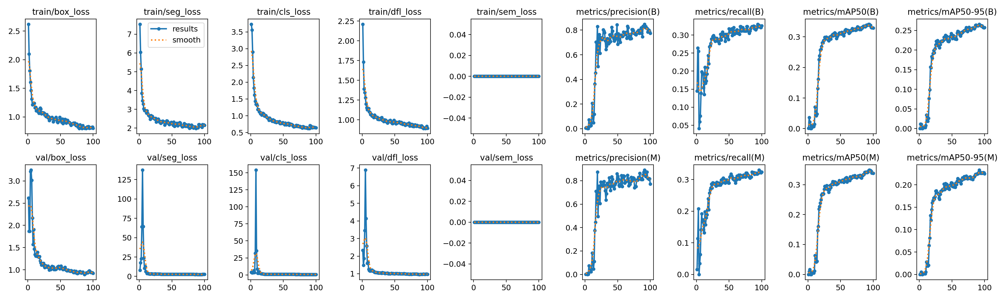
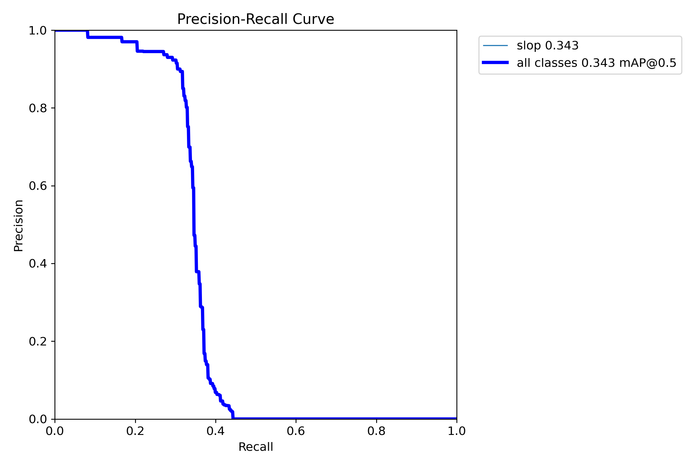
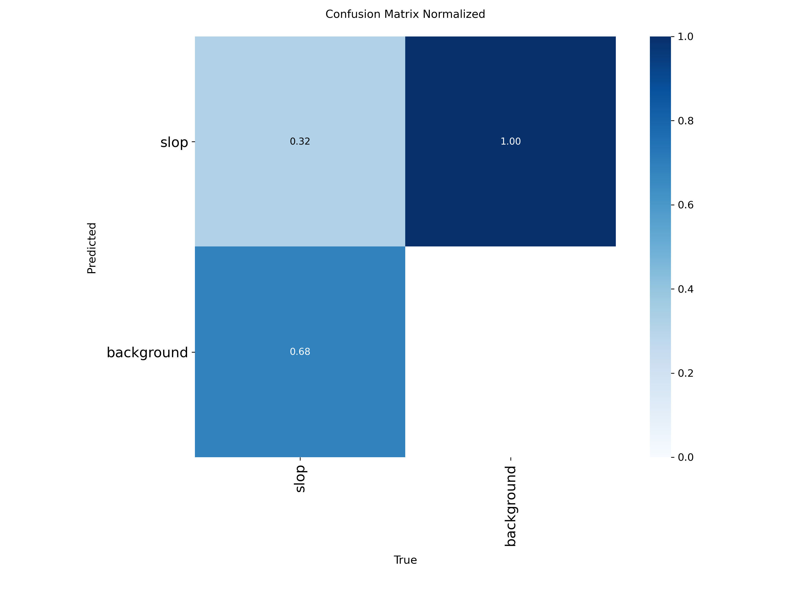

# HoleDetector

Detects construction excavation/dig holes from the perspective of the digging vehicle (excavator cab/boom-mounted camera), using SAM2-assisted labeling and a YOLOv8 segmentation model.

## Pipeline

```
download.py → extract_frames.py → dedup.py → label_sam2.py → prepare_yolo_dataset.py → train_yolo.py → detect.py
```

| Script | Purpose |
|---|---|
| `download.py` | Pull source videos from YouTube via yt-dlp |
| `extract_frames.py` | Extract frames from video at a configurable fps |
| `dedup.py` | Remove near-duplicate frames using perceptual hashing |
| `label_sam2.py` | Interactive click-to-segment labeling using SAM2 |
| `prepare_yolo_dataset.py` | Convert masks to YOLO-seg polygon labels, build train/val split |
| `train_yolo.py` | Fine-tune a YOLOv8-seg model on the labeled dataset |
| `detect.py` | Run the trained model on images, video, or a live feed |

## Setup

```bash
python3 -m venv venv
source venv/bin/activate      # Windows: venv\Scripts\activate
pip install -r requirements.txt
pip install git+https://github.com/facebookresearch/sam2.git
```

Also required:
- A SAM2 checkpoint (e.g. `sam2.1_hiera_large.pt`) from the [SAM2 repo](https://github.com/facebookresearch/sam2#model-description), placed in the project root.
- An NVIDIA GPU + driver is recommended for both SAM2 labeling and YOLO training, but everything falls back to CPU if unavailable.

## Usage

**1. Get footage and extract frames**
```bash
python scripts/download.py                 # edit the URLS list in the script first
python scripts/extract_frames.py --fps 1
```

**2. Deduplicate near-identical frames**
```bash
python scripts/dedup.py
```

**3. Label with SAM2**
```bash
python scripts/label_sam2.py
```
Left-click = mark hole, right-click = mark background, ENTER = save mask, `n` = skip, `q` = quit (progress is saved, resumable).

**4. Build the YOLO dataset**
```bash
python scripts/prepare_yolo_dataset.py
```

**5. Train**
```bash
python scripts/train_yolo.py --model yolov8n-seg.pt --epochs 100
```

**6. Run detection**
```bash
python scripts/detect.py --weights runs/hole_detector/weights/best.pt --source videos/your_clip.mp4 --show
```

## Results

Latest run (`hole_detector-3`, 142 labeled images, YOLOv8n-seg, 100 epochs):

| Metric | Value |
|---|---|
| Mask precision | 0.77 |
| Mask recall | 0.32 |
| mAP50 (mask) | 0.34 |
| mAP50-95 (mask) | 0.22 |

<p>
  
</p>
<p>
  
  
</p>

Precision is solid but recall is still low — the model is confident when it fires but misses most holes. See [`docs/RESULTS.md`](docs/RESULTS.md) for the full run history and what's planned to improve it (more labeled frames, the untouched `Storm_Drainage.mp4` video, and confidence-threshold tuning).

## Notes

- `videos/`, `frames/`, `frames_dedup/`, `masks/`, `dataset/`, `runs/`, and model weights (`*.pt`) are gitignored — they're either regenerable from the scripts or too large for git. Will share trained weights via a GitHub Release rather than committing them.
- Current label schema is single-class (`hole`). Extend `CLASS_NAMES` in `prepare_yolo_dataset.py` to add more classes (e.g. spoil piles, trench edges).
- Built as an experimental pipeline for ground-level/onboard dig-hole detection — not aerial/satellite construction monitoring.
